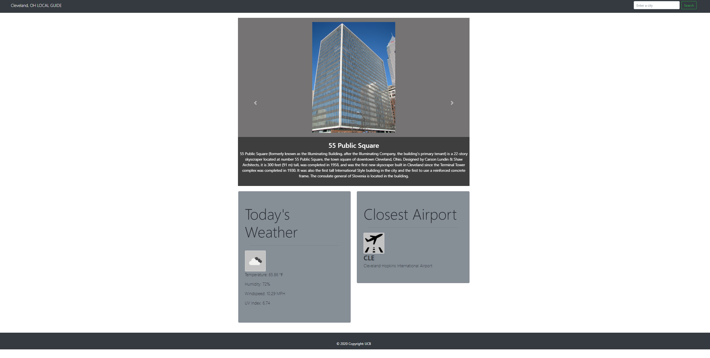

# Local Guide
## Purpose
This is a static website that provides weather condition, closest airports and interesting places to visit around any given US city. It would unleash the explorer in you. 

## Built With
* HTML 5
* CSS 3
* Javascript 1.8.5
* Bootstrap
* JQuery
* [Opentripmap API] (https://opentripmap.io/docs)
* [openweathermap API] (https://openweathermap.org/current)
* [Aeris weather API] (https://www.aerisweather.com/support/docs/api/reference/endpoints/places-airports/)

## Website
https://hameed1239.github.io/local-guide/

## Prerequisites
* Obtain an API key from the 3 listed APIs listed above. 

## Deployment information
* Clone the repository
* Replace the invalid API key with your obtained API key
* Deploy to a website

## Contribution 
* [Hameed Kazeem] (https://github.com/hameed1239)
* [Sadegh Torabi] (https://github.com/Torabis)
* [Chad Gingery] (https://github.com/cmike212348)

